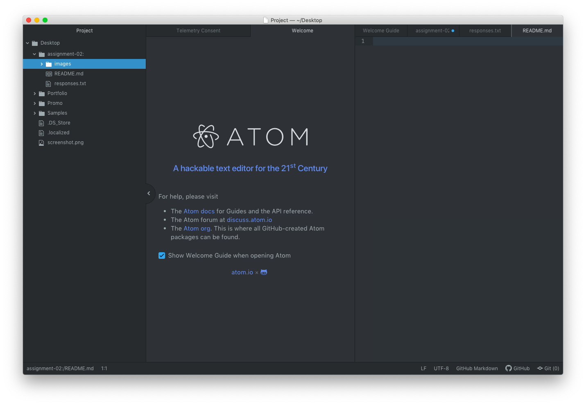

# Assignment 2
## Earl Clark
Web design seems to be an increasingly valuable skill and I want the ability to
design a website.  I've never done any coding before and this class will force
me to give it a shot.  For the media arts minor, this class and the second
photoshop class fulfill two of the electives that I think should be staples of
the minor, and so I'm taking them.

- data travels in three ways: by electricity, by light, by radio wave
- URL stands for uniform resource locator
- the internet is a physical, fragile system

[UM](https://www.umt.edu)

[Responses.txt](./responses.txt/)

