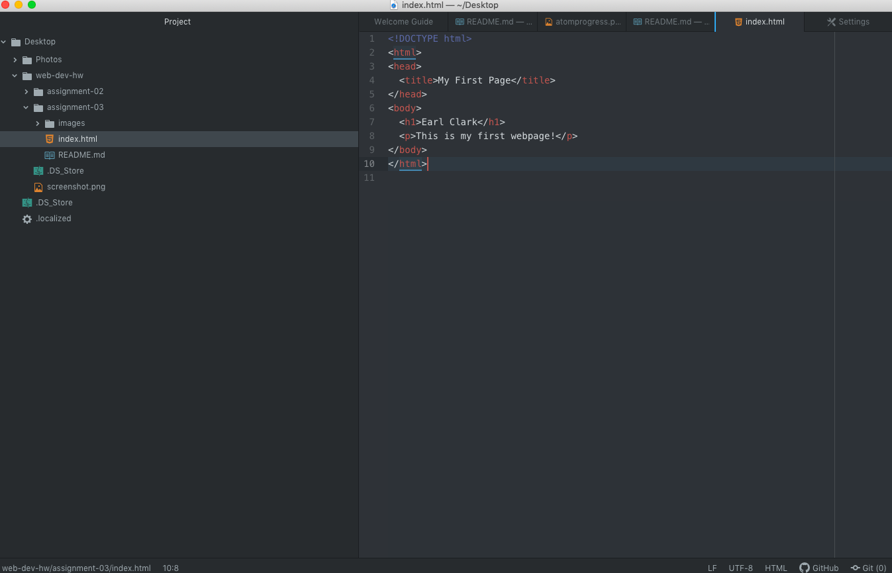

# Assignment 3
## Earl Clark
1. I use Safari to browse the web.  When a website is inputed into the search
bar the browser sends a request to a server and the server sends back web
content of the site.  Through the rendering engine, the browser engine, and a
javascript interpreter, object models are created and the site is built for the
user.

2. A markup language dictates the architecture of a webpage, primarily focusing
on the text of the page.  HTML, the standard web language, sets the content
and structure of a page so other work can be done and so that the page can be
viewed in the browser.

