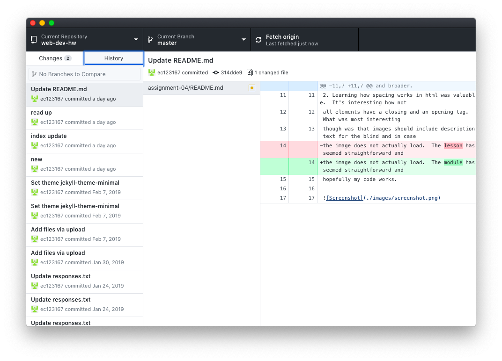

# Assignment 4
## Earl Clark
1. I visited the [Postcrossing](https://web.archive.org/web/20051124060835/http://postcrossing.com/) site back in its launch year in 2005.  The site was very
bland and simplistic.  It's as simple as it could have been while still
providing a service.  It's like a series of pages that could be printed out and
stapled together rather than an interactive site; that's how bland it is. [Today](https://www.postcrossing.com/) the site is still simplistic, but it is elegantly
simplistic and includes many more images and feels like a website rather than a
skeleton.  There are dropdown menus, more color, and space is delineated cleaner
and broader.

2. Learning how spacing works in html was valuable.  It's interesting how not
all elements have a closing and an opening tag.  What was most interesting
though was that images should include description text for the blind and in case
the image does not actually load.  The lesson has seemed straightforward and
hopefully my code works.

